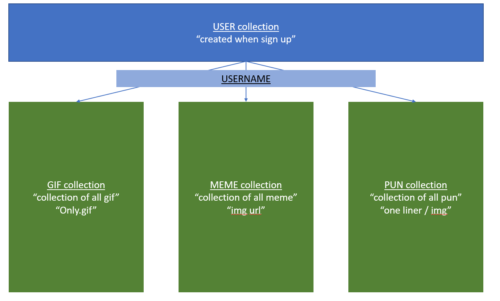
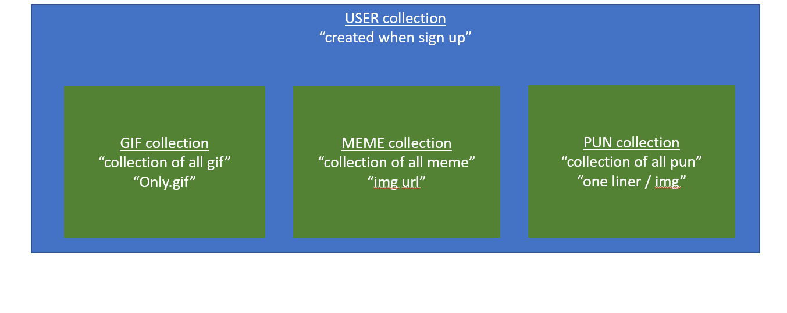
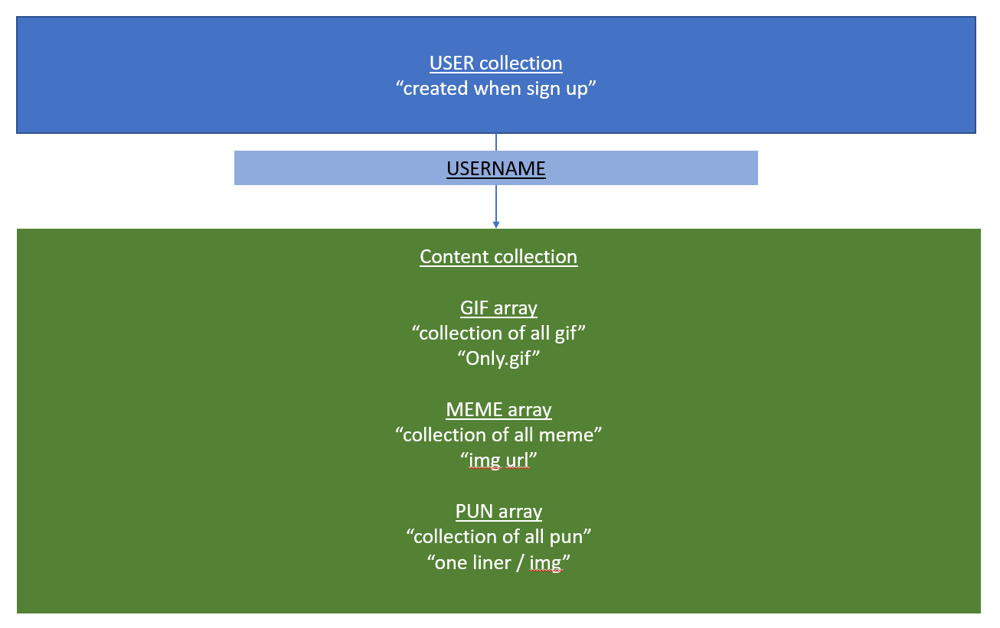

# Project three scope
- collaborator 
1) Javier 
2) Jared
3) Yue Jia

# App Title - Playboy starter app

description

## Application link

- (link to application)

## Table of Contents
- [Introduction](#Introduction)
- [Project Approach](#project-approach)
- [Technology Used](#Technology-used)
- [Methodology Used](#Methodology)
- [Main Features](#Main-features)
- [User Journey Map](#User-Journey-Map)
- [Bonus](#Bonus)
- [Developer Journey](#Developer-Journey)
- [Future Development](#Future-Development)

# Project scope

## Introduction

Playboy starter pack is a handy app for young adults both in a single / attached relationship to quickly find a meme / pun / gif to impress or have fun with their female counterpart. There are evidence in our society that young adults are not as shy as previous generation in approaching strangers to express their interest in that person. Dating apps such as Tinder and Coffee & Bagel are popular platforms among young adults to expand their social circle as well as finding their life-long partner to share their lives with. As such "Playboy starter pack" aims to be a library for men to search for the perfect pickup lines to start conversation with their counterpart in a light-hearted romantic way. 

This app also aimed to provide a library to attached couples as well. Partners can dived into the library to find an item to share with each other to enjoy an moment of laugh, cringiness and romanticism. In doing so, a relationship could be injected with some life whenever it gets dull and reignites passions for each other whenever necessary.

Playboy starter pack aims to help spark and maintain relationship among young adults. It is important to note that this app helps to start and spark. the rest is up to individual efforts to bring their love relationship to the next level. 

Playboy starter pack also allows sign up member to add content into the library to hsare with other users. 

## Project Approach

The approach to this project is to have a systematic segregation of database and reduction of nested data to ensure optimize performance in retrieving data. The approach to databases is to have 4 seperate databases (user, meme, pun, gif) with each database connected by a username key value pair. 

The project also aim to achieve as minimum view state as possible to reduce rendering time and optimize data fetching time.
The project will be split up into 3 main contents, tackled by a single person with a universal methodology to achieve minimum conflict and faster building time.

We aim to approach project in step by step manner
1) Design landing page
2) Design data structure ( with a seed data)
3) Design User login / signup authentication
4) Design dashboard page (segmented by memes / puns / gif)
5) Design 1 user dashboard page (segmented by memes / puns / gif)
6) Design workflow ( CRUD )
7) Test and troubleshooting
8) Bonus ( if have time)
9) Deployment of app


## Main Features
1. Registration and login
   - Includes authentication and encrypted password
2. Create new post
   - Required fields: Image link
   - Non-required fields: Caption
   - (Bonus): Hashtag function in caption similar to Instagram
3. Edit post
   - Able to edit caption of a particular post user created
   - Able to edit comments made by user
   - User will not be able to edit caption of other user's post
   - User will not be able to edit comment made by other user
4. Delete post
   - Able to delete a particular post that user created
5. Dashboard to show all the memes, gifs and puns created by all the users
   - This will show all the latest feed
6. React routing for multi-page views
7. (Bonus): Able to search post
   - Either search by keywords in post's caption or hashtag
8. (Bonus): Able to search other users
   - After searching, user is able to follow the other user

## User Journey Map
### 1. Landing Page
As a user, I want to know what this application is about when I first land onto this website.

### 2. Registration Page
As a user, I want to be able to register a new account.

### 3. Login Page
As a user, I want to be able to login to the application.

### 4. Home Page
As a user, I want to be able to see all the memes, gifs and puns in this application.
- Memes, gifs and puns that were created by users will be pushed to the Home Page, as well as their [Personal Profile Page](#6.-personal-profile-page).

### 5. Create Memes/Gifs/Puns Page
As a user, I want to be able to create new memes, gifs and puns in this application.

### 6. Personal Profile Page
As a user, I want to be able to view all the memes, gifs and puns I have created in my own personal profile.

### 7. Edit Memes/Gifs/Puns
As a user, I want to be able to edit the memes, gifs and puns that I have created.
- User is able to edit caption and comments made by them.

### 8. Delete Memes/Gifs/Puns
As a user, I want to be able to delete the memes, gifs and puns that I have created.

## Technology Used

1) MongoDb / Mongoose
2) React.js
3) Authentication services ( session / passport.js)
4) Express.js
5) Node.js
6) Multer (uploading img)
7) Heroku deployment ( for backend )
8) github pages ( for frontend )
9) Apis Used (IF NECESSARY AND FOR BONUS)
 - memes api (https://api.imgflip.com/)
 - gif api (https://tenor.com/gifapi/documentation#quickstart-search)
 - puns/jokes api (https://rapidapi.com/webknox/api/jokes?endpoint=55c2a0a7e4b011e6e59410ca)
10) AJAX
11) JQUERY
12) MDBREACT CSS
13) BOOTSTRAP 
14) External source
    - (if any, to be added)

## Methodology

### On CRUD
Creating content with different specifications. 
- Gif - Need to upload a image in .gif format in gif section
- puns - descriptive / strings
- memes - in https:// url string. 


### data structure (three options)
- Below schema is only one out of the three options. 

Option 1

option 2

option 3


1) segregated collections (option 1)
- user collection (user's schema)
    ```
    {
      $jsonSchema: {
         bsonType: 'object',
         required:['username','email','password'],
         properties: {
               username: {
               bsonType: 'string'
               },
               proImg: {
               bsonType: 'string',
               description : 'url string starting from https'
               },
               biography : {
               bsonType: 'string'
               }
               email: {
               bsonType: 'string'
               },
               password: {
               bsonType: 'string'
               },
               createdAt: {
               bsonType: 'date'
               },
               lastLoggedInAt: {
               bsonType: 'date'
               }
         }
      }
    }
    ```
- memes collection (memes's schema)
    ```
   {
      $jsonSchema: {
         bsonType: 'object',
         required:['username'],
         properties: {
            username: {
            bsonType: 'string'
            },
            memes: {
            bsonType: 'array',
            uniqueItems: true,
            description : 'collection of memes created by user',
               items : {
                  bsonType: 'object',
                  required : ['memeId','createdBy', 'createdAt']
                  properties: {
                     memeId : {
                        bsonType : ObjectId,
                        },
                     memeImg : {
                        bsonType : 'string',
                        description : 'it must be in https'
                        },
                     description : {
                        bsonType : 'string',
                        },
                     createdBy : {
                        bsonType : 'string'
                        },
                     createdAt : {
                        bsonType : 'string'
                        },
                     tags: {
                        bsonType : 'array',
                        uniqueItems : true,
                        items : {
                           bsonType : 'string'
                           }
                        }
                     }
                  }
               }
            }
         }
      }
    }
    ```

- gifs collection (gif's schema)
    ```
   {
      $jsonSchema: {
         bsonType: 'object',
         required:['username'],
         properties: {
            username: {
            bsonType: 'string'
            },
            gifs: {
            bsonType: 'array',
            uniqueItems: true,
            description : 'collection of gifs created by user',
               items : {
                  bsonType: 'object',
                  required : ['gifId','createdBy', 'createdAt']
                  properties: {
                     gifId : {
                        bsonType : ObjectId,
                        },
                     gifImg : {
                        bsonType : 'string',
                        description : 'it must be in https and .gif format'
                        },
                     description : {
                        bsonType : 'string',
                        },
                     createdBy : {
                        bsonType : 'string'
                        },
                     createdAt : {
                        bsonType : 'string'
                        },
                     tags: {
                        bsonType : 'array',
                        uniqueItems : true,
                        items : {
                           bsonType : 'string'
                           }
                        }
                     }
                  }
               }
            }
         }
      }
    }
    ```

- puns collection (gif's schema)
    ```
   {
      $jsonSchema: {
         bsonType: 'object',
         required:['username'],
         properties: {
            username: {
            bsonType: 'string'
            },
            gifs: {
            bsonType: 'array',
            uniqueItems: true,
            description : 'collection of pun created by user',
               items : {
                  bsonType: 'object',
                  required : ['punId','createdBy', 'createdAt']
                  properties: {
                     punId : {
                        bsonType : ObjectId,
                        },
                     punImg : {
                        bsonType : 'string',
                        description : 'Optional, not required. Image to discribe the pun'
                        },
                     description : {
                        bsonType : 'string',
                        },
                     createdBy : {
                        bsonType : 'string'
                        },
                     createdAt : {
                        bsonType : 'string'
                        },
                     tags: {
                        bsonType : 'array',
                        uniqueItems : true,
                        items : {
                           bsonType : 'string'
                           }
                        }
                     }
                  }
               }
            }
         }
      }
    }
    ```


## Bonus
(if have time)
Added features
- A quick button to generate random pickup lines / memes / puns / gif
- Update / Edit User profile
- User can follow and being followed by other users
- Send notification to user email whenever user is being followed and new content is created by their favourite users
- Search function to search content based on themes. (Using Ajax call query)
- Music tracks added for individual users


